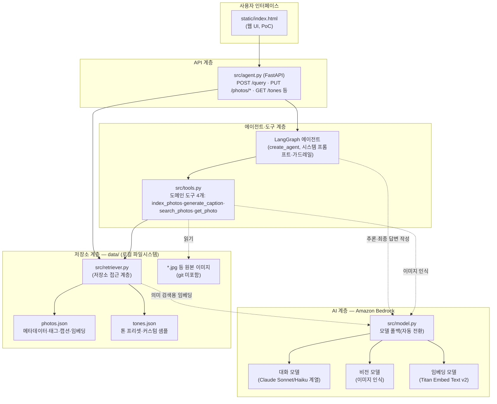
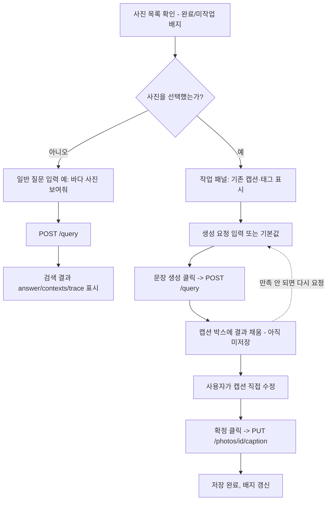
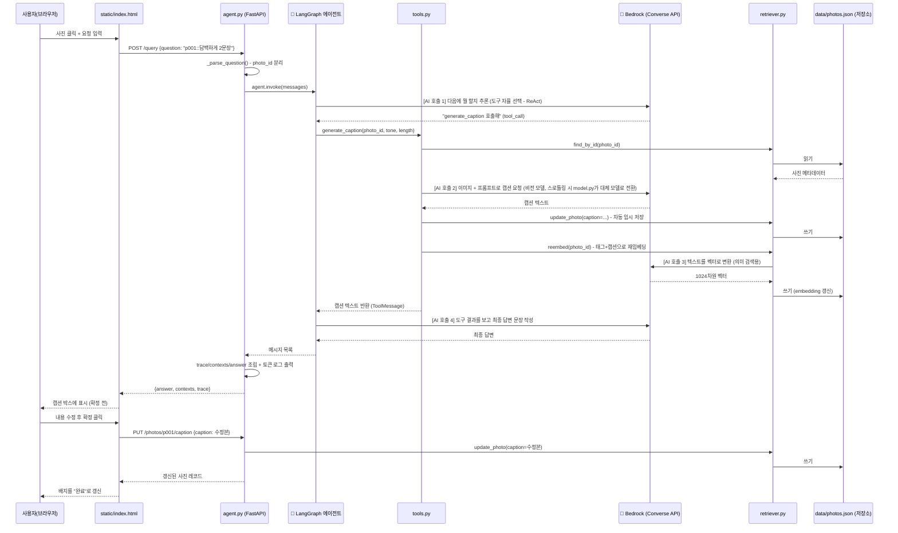
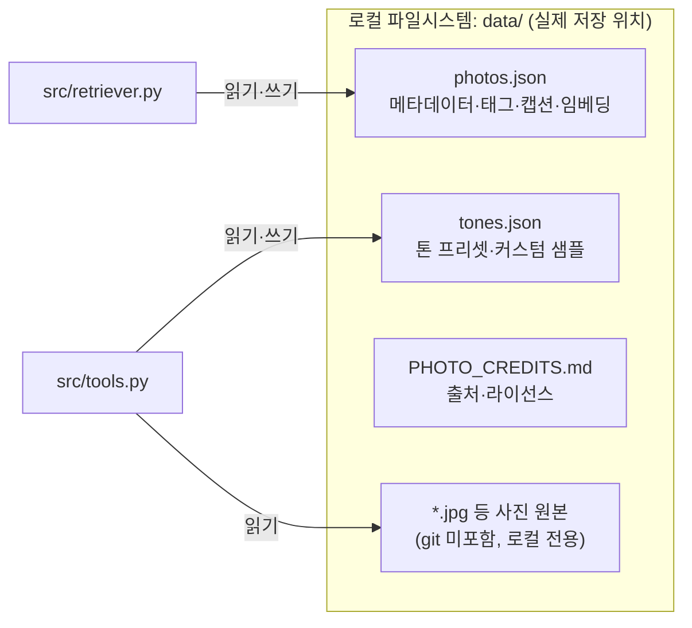

# 미니 PJT: 찰칵일상 (Chalkak-ilsang)

## 무엇을 푸나
개인 사진첩을 정리하고 싶은 사람이, 사진마다 어울리는 설명 글을 직접 써야 하고 원하는 기준으로 찾기도 어려운 문제를 푼다 — 사진을 올려두면 원하는 톤·분량으로 설명을 자동으로 받고, 자동 태그로 자연어·필터 검색까지 할 수 있다.

## 활용한 패턴 (Day 1~7)
- Day 1: LCEL chain (구조화 출력) — `POST /query` 응답을 `answer`/`contexts`/`trace` 로 구조화
- Day 2: RAG — `src/embeddings.py`(Bedrock Titan Embed Text v2)로 태그·캡션을 임베딩해두고, `retriever.py`가 질의어와의 코사인 유사도(+키워드 보너스)로 상위 8건을 후보로 추려주면(임계값 방식은 짧은 질의에서 불안정해 폐기) 최종 관련성 판단은 에이전트가 함
- Day 3: ReAct (도구 자율 선택) — `create_agent` 가 상황에 따라 4개 도구 중 필요한 것만 부름
- Day 4: 도구 다중 결합 — 검색 → 상세조회 → 캡션생성을 한 대화 안에서 조합
- Day 5: 가드레일 — 등록되지 않은 사진에 대해 지어내지 않기, 지정하지 않은 톤·분량 임의 변경 금지 (SERVICE.md 4번)
- Day 7: Observability — 도구 호출 내역을 `trace` 필드로 노출
- Day 7: 평가 — `evaluation/test_queries.csv` 인-아웃 세트로 자체 평가 (아래 결과 참고)

## 아키텍처

### 컴포넌트 구성도 (Logical View)
저장소·AI·시스템(에이전트/API/UI)을 계층으로 나눈 구조도. 실선은 항상 거치는 호출, 점선은 AI(Bedrock) 호출이다.



### 코드 호출 순서 (텍스트 다이어그램)
```
사용자(웹 UI, PoC)
  └─ 사진 클릭 + 요청 문구 입력
       └─ "photo_id::요청문구" 형태로 조립
            └─ POST /query { "question": "..." }
                 └─ src/agent.py
                      ├─ _parse_question(): photo_id 분리
                      ├─ build_chat_model() (src/model.py) — 기본 모델 호출 실패(스로틀링 등) 시
                      │     후보 모델 목록으로 자동 전환하는 모델을 만듦 (with_fallbacks)
                      ├─ create_agent(model, tools=4개, system_prompt=가드레일+오늘 날짜)
                      │     ├─ index_photos    ─┐
                      │     ├─ generate_caption ─┼─ src/tools.py (도메인 도구, 모델 호출은 model.py 공용)
                      │     ├─ search_photos    ─┤     └─ src/retriever.py (data/photos.json 읽기·쓰기·검색)
                      │     └─ get_photo       ─┘
                      └─ 도구 호출 결과를 answer/contexts/trace 로 구조화해 응답

[AI 호출 지점] build_chat_model() 이 만든 모델 = Bedrock 대화 모델(에이전트 추론용)
              tools.py 의 index_photos·generate_caption = Bedrock 비전 모델(이미지 인식용)
              retriever.py 의 reembed·search = Bedrock 임베딩 모델(의미 검색용)
              → 전부 실제 저장소가 아니라 Bedrock API 호출이고, 결과만 아래 저장소에 남는다

[저장소] data/ 폴더 (로컬 파일시스템, DB 아님) — 자세한 위치는 "데이터 저장 구조" 참고
```
사진 원본 파일은 로컬에만 두고(`data/*.jpg`, git 미포함), 태그·캡션 등 메타데이터만 `data/photos.json` 에 커밋된다. 톤 프리셋·커스텀 톤 샘플은 `data/tones.json`.

### 사용자 인터페이스 흐름
`static/index.html` 기준. 사진을 고르면 캡션 작업 패널이, 안 고르면 일반 검색창이 뜬다.



검색 결과 화면은 `answer`(자연스러운 문장으로 정리, 언급된 사진 ID는 썸네일로도 같이 표시)와 `contexts`/`trace`를 원본 JSON 그대로 보여준다. 후자는 실제 서비스 UX가 아니라 **PoC 단계에서 에이전트가 무슨 근거로 어떻게 답했는지 확인하기 위한 디버그용 노출**이다 — 정식 제품이라면 이 부분은 화면에 안 보이게 하고 로그로만 남기는 게 맞다.

### 요청·데이터 흐름
사진을 선택해 캡션을 생성·확정하는 경우의 전체 호출 경로.

참여자 이름 앞의 🤖는 실제로 Bedrock을 호출하는(=AI를 쓰는) 지점이다. 나머지는 코드·저장소 로직뿐이다.



이 흐름에서 **Bedrock(AI)이 실제로 관여하는 건 4곳**뿐이다 — ① 다음 행동 추론(에이전트 두뇌) ② 이미지 인식(비전 모델) ③ 임베딩(의미 검색용 벡터화) ④ 최종 답변 문장 작성. 그 외(저장·조회·태그 필터링·라우팅)는 전부 평범한 코드이지 AI 호출이 아니다.

### 데이터 저장 구조
데이터는 별도 DB 없이 **로컬 파일시스템의 `data/` 폴더**에 그대로 저장된다.



| 파일 | 역할 | 주요 필드 |
|---|---|---|
| `data/photos.json` | 사진별 메타데이터·인덱싱 결과 저장소. `retriever.py`가 유일한 읽기·쓰기 창구 | `id`, `filename`, `taken_at`/`location`(검증 안 되면 `null`), `tags`(리스트), `caption`, `caption_tone`, `embedding`(태그+캡션의 1024차원 의미 검색용 벡터) |
| `data/tones.json` | 톤 프리셋 + 사용자 커스텀 톤 샘플 | `presets[].{id,name,guide,default}`, `custom.{id,guide,samples[]}` |
| `data/PHOTO_CREDITS.md` | 샘플 사진 출처·라이선스 (사진 원본은 git 미포함이라 근거만 기록) | - |

`retriever.py`의 `load_photos`/`save_photos`/`update_photo`가 파일 전체를 읽고 다시 쓰는 방식이라(원자적 트랜잭션 아님), 여러 요청이 동시에 같은 사진을 고치는 상황은 고려하지 않았다 (PoC 범위).

**벡터 저장 방식과 규모 한계**: `embedding`은 별도 벡터 DB 없이 `photos.json` 안에 배열로 그대로 저장하고, `search()`가 매번 전체를 순회하며 코사인 유사도를 브루트포스로 계산한다 (사진 수십 장 규모에서는 충분히 빠름). 사진이 수천~수만 장 이상으로 늘어나면 이 방식은 느려지므로, 그때는 FAISS·Chroma 같은 로컬 벡터 인덱스나 Pinecone·OpenSearch(벡터 엔진) 같은 관리형 벡터 DB로 옮기는 게 맞다 — 임베딩을 별도 저장소로 옮기고 `photos.json`은 ID로 그 저장소를 가리키기만 하면 된다.

### 의미 검색(RAG)이 동작하는 원리
"사람들이 움직이는 사진 찾아줘"처럼 사진의 태그·캡션 어디에도 없는 표현으로 검색해도 관련 사진(예: 복도를 걸어가는 사람이 담긴 p022 — 태그 "여행객", 캡션에 "...멀리 걸어가는 사람들이 있다")이 찾아지는 건 아래 두 단계가 나뉘어 있기 때문이다.

**1) 색인 시점 — 이미지를 텍스트로, 텍스트를 벡터로**
- `index_photos`·`generate_caption`(Bedrock 비전 모델)이 사진을 실제로 보고 태그·캡션 텍스트를 만든다.
- `retriever.reembed()`가 그 텍스트를 임베딩 모델(Titan Embed Text v2)에 보내 1024차원 벡터로 바꿔 `photos.json`에 저장한다. **이 단계의 임베딩 모델은 이미지를 다시 보지 않고, 앞서 만들어진 텍스트만 본다.**

**2) 검색 시점 — 질의도 벡터로 바꿔서 거리만 비교**
- 사용자 질의("사람들이 움직이는 사진")도 같은 임베딩 모델로 벡터로 바꾼다.
- 저장된 모든 사진 벡터와 코사인 유사도(벡터 사이 각도)를 계산해 가까운 순으로 정렬한다 (`retriever.search()`).

**왜 "움직이는"과 "걸어가는 사람들"이 매칭되는가**: 검색 시점에 "이게 관련 있나"를 별도로 판단하는 단계는 없다. Titan Embed Text v2가 사전 학습 과정에서 "움직이다·걷다·이동하다"처럼 뜻이 비슷한 표현을 벡터 공간에서 서로 가깝게 배치하도록 이미 학습돼 있어서, 두 문장을 각각 벡터로 찍어보면 의미가 비슷한 만큼 가까운 위치에 놓이는 것뿐이다.

정리하면 "판단"은 두 번만 일어난다 — ① 색인 시점에 비전 모델이 이미지를 텍스트로 옮길 때, ② 검색 응답 시점에 에이전트가 후보 목록을 보고 진짜 관련 있는 걸 추려낼 때. 그 사이(임베딩 변환·벡터 거리 계산)는 판단이 아니라 사전 학습된 벡터 공간에서의 기계적인 계산이다.

### 응답 출력 형식
`POST /query`는 항상 아래 세 키만 돌려준다 (CLAUDE.md 제출 규약).
```json
{
  "answer": "모델이 만든 최종 답변 문자열",
  "contexts": [
    {"doc_id": "search_photos", "text": "도구가 실제로 반환한 내용"}
  ],
  "trace": [
    {"step": "search_photos", "input": null, "output": "도구가 반환한 원문"}
  ]
}
```
`contexts`/`trace`는 에이전트가 실행 중 호출한 도구(`ToolMessage`) 하나당 한 항목씩 쌓인다. `PUT /photos/{id}/caption`은 이 계약과 무관한 앱 전용 엔드포인트로, 갱신된 사진 레코드(JSON)를 그대로 돌려준다.

**모델 폴백**: Bedrock은 모델별로 별도의 사용량 한도가 있어, 기본 모델(`.env`의 `BEDROCK_MODEL_ID`)이 스로틀링(`ThrottlingException` 등 `ClientError`)에 걸리면 `src/model.py`의 `FALLBACK_MODEL_IDS` 목록(Claude Sonnet/Haiku 최신 버전, Amazon Nova 계열 등)을 순서대로 자동 시도한다. `agent.py`(대화용 모델)·`tools.py`(이미지 인식용 모델) 둘 다 이 모듈을 통해 모델을 만든다. Bedrock을 호출하는 모든 지점(`ask()`, `index_photos`, `generate_caption`)은 실제로 응답한 모델명과 입출력 토큰 수를 `[tokens] ...` 로그로 남긴다.

## 실행 방법
```bash
python -m venv .venv
source .venv/bin/activate        # Windows: .venv\Scripts\activate
pip install -r requirements.txt
cp .env.example .env             # BEDROCK_MODEL_ID, AWS_REGION, AWS 자격증명 채우기
uvicorn src.agent:app --host 0.0.0.0 --port 8000   # 서버로 실행
# 또는 CLI로 빠르게 확인
python -m src.agent "작년 여름 제주도 사진 보여줘"
```
`run.sh` 도 위 과정을 그대로 수행한다. 서버 실행 후 브라우저로 `http://localhost:8000/` 에 접속하면 사진 목록·선택·요청 입력이 되는 데모 페이지(`static/index.html`, PoC 수준)가 뜬다.

### 캡션 생성을 Gemini로 돌리기 (선택)
기본은 전부 Bedrock이다. 캡션 생성(`generate_caption`)만 Google Gemini로 바꾸고 싶으면 `.env`에 아래 세 값을 채운다.
```bash
CAPTION_LLM_PROVIDER=gemini      # 기본값 bedrock. 안 건드리면 기존과 동일하게 동작
GEMINI_MODEL_ID=gemini-2.5-flash
GEMINI_API_KEY=발급받은_키
```
에이전트 오케스트레이션(도구 선택·최종 응답 조립)과 사진 태깅(`index_photos`), RAG 임베딩은 이 설정과 무관하게 항상 Bedrock을 쓴다 — "문장 생성만 Gemini로 대체"하는 용도다.

## RAGAS 평가 결과
_(Day9 자체 평가 진행 후 채움)_
- context_recall:
- context_precision:
- faithfulness:
- answer_relevancy:

## 인-아웃 세트 통과율 (자체 평가)
_(Day9/Day10 자체 평가 진행 후 채움 — evaluation/round1_report.md, round2_report.md 참고)_
- 1차 (Day 9 종료): XX / 20 통과
- 2차 (Day 10 개선 후): XX / 20 통과
- 개선폭:

## 트라이앤에러 회고
_(진행하며 채워나감 — 자세한 경위는 PROGRESS.md 참고)_
- 패키지를 처음에 전역 파이썬에 설치했다가 가상환경(.venv)으로 정정
- "샘플 사진은 풍경 위주로만" 결정을 한 번 내렸다가, SERVICE.md의 가드레일 정책(인물·GPS 감지 시 경고)과 앞뒤가 안 맞아 되돌림
- Bedrock은 계정 전체가 아니라 **모델별로** 사용량 한도가 있어, 기본 모델이 스로틀링되면 대체 모델 목록으로 자동 전환하도록 함 (`src/model.py`)
- `data/photos.json`의 `location`(예: "제주 협재해변") 값이 실제 사진 내용과 무관한 옛 더미 데이터였는데, 그걸 그대로 캡션 프롬프트에 "참고 정보"로 넣어 근거 없는 사실을 캡션에 반영하는 문제가 있었음 — 위치 메타데이터를 전부 제거하고, "메타데이터가 있다고 사실처럼 반영하지 않는다"는 원칙을 SERVICE.md·프롬프트에 명문화
- 캡션 생성만 Gemini로 바꿔봤더니 결과 캡션에 알아볼 수 없는 긴 문자열이 섞여 나옴 — `ChatBedrockConverse`의 `response.content`는 순수 문자열이지만 `ChatGoogleGenerativeAI`는 `[{"type": "text", "text": ...}, {"extras": {"signature": ...}}]` 형태의 content-block 리스트를 돌려주는데, 기존 코드가 `str(response.content)`로 그대로 문자열화해 서명 데이터까지 캡션에 섞여 들어갔던 것 — text 블록만 골라 뽑는 `_response_text()` 헬퍼로 교체 (`src/tools.py`)

## 핵심 코드 위치
- `src/model.py` — `build_chat_model()`: 에이전트·태깅용 Bedrock 모델 생성, 기본 모델 실패 시 후보 목록으로 자동 전환 (`with_fallbacks`). `build_caption_model()`: 캡션 생성 전용, `.env`의 `CAPTION_LLM_PROVIDER`로 Bedrock/Gemini 선택
- `src/tools.py` — `_response_text()`: 모델 응답에서 텍스트만 안전하게 추출 (Bedrock은 문자열, Gemini는 content-block 리스트라 형태가 다름)
- `src/agent.py:23` — `_system_prompt()`: 가드레일 + 오늘 날짜(상대 날짜 표현 계산용) 포함한 시스템 프롬프트
- `src/agent.py:43` — `_build_agent()`: 4개 도구를 묶은 에이전트 생성
- `src/agent.py:53` — `_parse_question()`: `photo_id::요청` 파싱
- `src/agent.py:64` — `ask()`: 에이전트 호출 후 answer/contexts/trace 조립 + 토큰 사용량 로깅
- `src/agent.py:104` — `POST /query` 엔드포인트
- `src/agent.py:120` — `PUT /photos/{photo_id}/caption`: 사용자가 고친 캡션 확정 저장 (에이전트 미경유 앱 기능)
- `src/tools.py` — `index_photos`·`generate_caption`·`search_photos`·`get_photo` 4개 도구
- `src/embeddings.py:17` — `embed_text()`: Bedrock Titan Embed Text v2로 텍스트를 벡터로 변환
- `src/retriever.py:66` — `reembed()`: 태그+캡션 기반 임베딩 재계산·저장 (`index_photos`·`generate_caption`이 갱신 시점마다 호출)
- `src/retriever.py:120` — `search()`: 키워드+의미(코사인 유사도) 하이브리드 검색
- `static/index.html` — 데모용 정적 페이지 (사진 목록·선택·요청 입력, PoC 수준). `src/agent.py`의 `GET /`, `GET /data/*` 로 서빙됨
